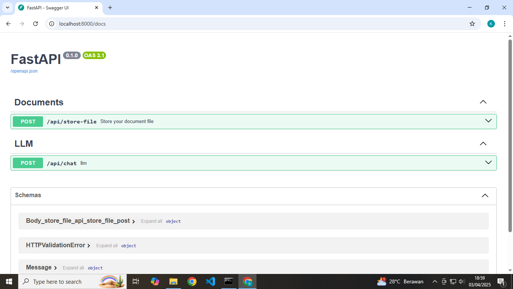

# Retrieval Augmented Generation (RestAPI)

This project demonstrates how to implement a Retrieval Augmented Generation (RAG) using FastAPI. It integrates document retrieval mechanisms with generative AI to enhance response generation based on external knowledge sources.

## Features

- Retrieval Mechanism: Fetch relevant documents from a knowledge base to provide context-aware responses.

- Generative AI Integration: Uses a language model to generate responses based on retrieved data.

## Prerequisites

- Python 3.10.x ++

- FastAPI

## Run Locally

Clone the repository or download the project directly from GitHub

```bash
  git clone https://github.com/komikodok/rag-fastapi
```

Create a virtual environment

```bash
  python -m venv .venv
```

Install dependencies

```bash
  pip install -r requirements.txt
```

## Screenshots
Dekstop
